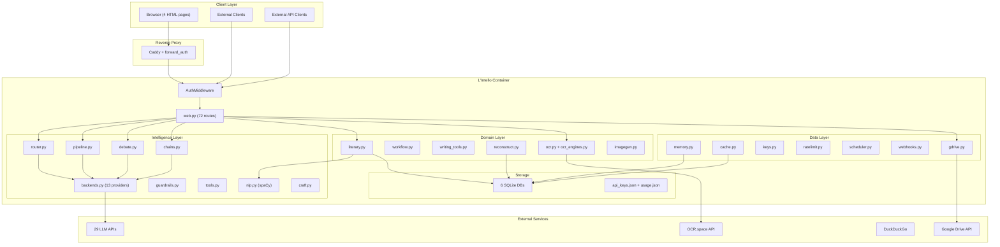
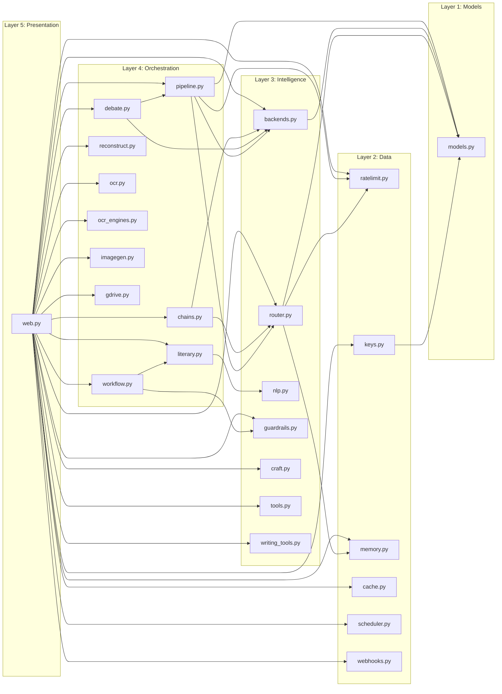
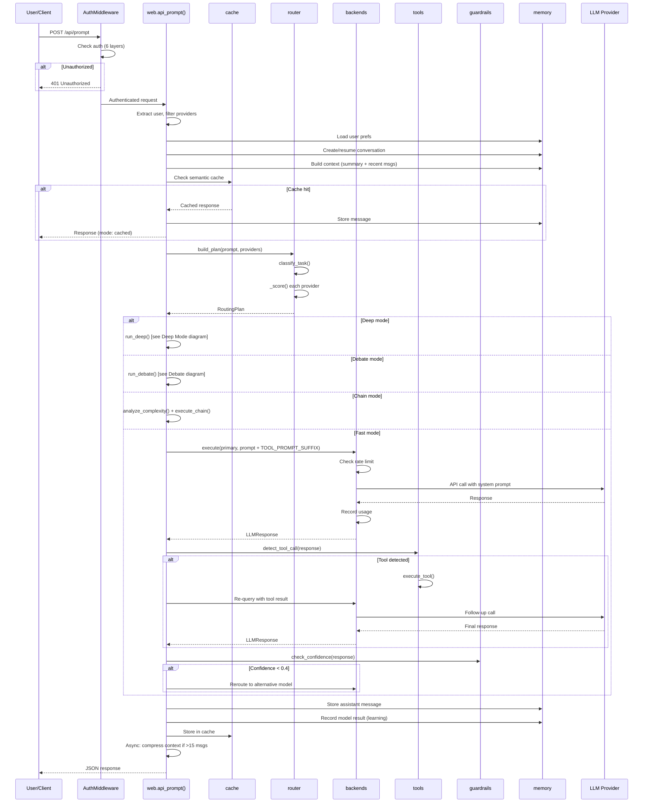
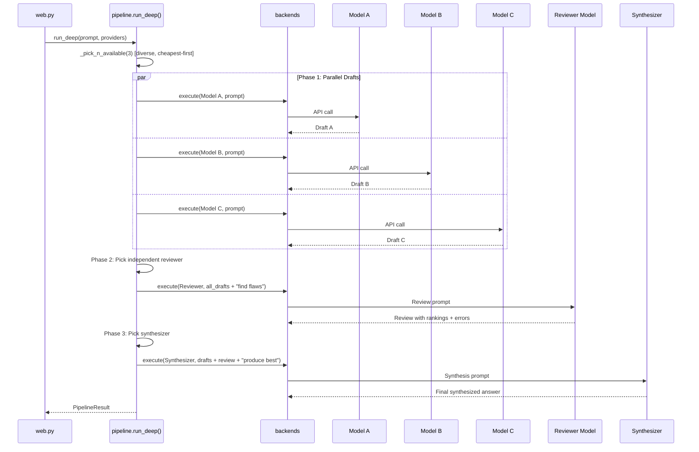
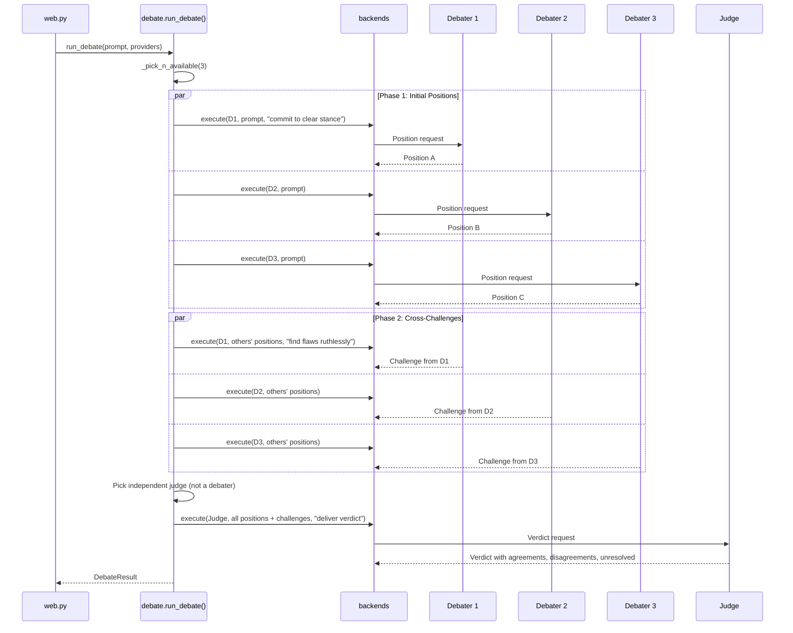
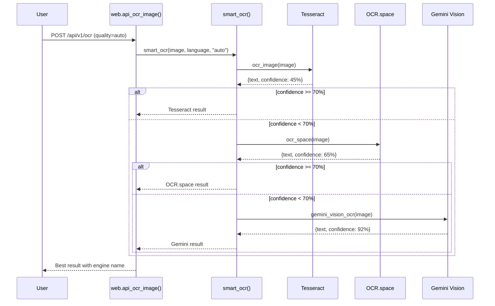
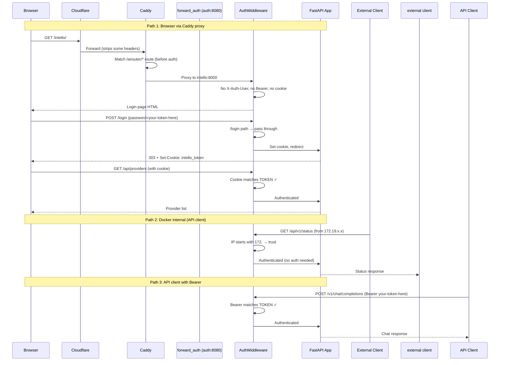

# L'Intello — Architectural Design Document

## 1. Architecture Overview



## 2. Module Dependency Graph



## 3. Primary Data Flow: Prompt Processing



## 4. Deep Mode Pipeline



## 5. Debate Mode



## 6. OCR Escalation Flow



## 7. Authentication Flow




## 8. Physical File → Component Mapping

| File | Component | Lines | Functions | Purpose |
|------|-----------|-------|-----------|---------|
| `models.py` | Core | 60 | 5 (classes) | LLMProvider, RoutingPlan, LLMResponse, TaskType, Tier |
| `research.py` | Core | 160 | 2 | 29 provider definitions + market probing |
| `router.py` | Intelligence | 154 | 5 | Task classification + provider scoring + plan building |
| `backends.py` | Intelligence | 213 | 14 | 12 _call_* functions + execute() + SYSTEM_DEFAULT |
| `nlp.py` | Intelligence | 101 | 5 | spaCy NER, sentence segmentation, linguistic features |
| `guardrails.py` | Intelligence | 96 | 3 | Confidence scoring, word count verification |
| `craft.py` | Intelligence | 138 | 2 | 50+ literary techniques, dynamic selection |
| `tools.py` | Intelligence | 152 | 6 | Web search, calculator, Python sandbox, tool detection |
| `writing_tools.py` | Intelligence | 123 | 7 | 7 prompt generators (show/describe/tone/brainstorm/shrink/draft/beta) |
| `pipeline.py` | Orchestration | 161 | 4 | Deep mode: draft → review → synthesis |
| `debate.py` | Orchestration | 117 | 1 | Debate mode: positions → challenges → verdict |
| `chains.py` | Orchestration | 126 | 2 | Chain mode: decompose → route → synthesize |
| `workflow.py` | Orchestration | 176 | 4 | Writing workflow: phases, h/v modes, prompts |
| `literary.py` | Domain | 663 | 27 | Document ingestion, structure, pacing, edits, projects |
| `reconstruct.py` | Domain | 323 | 11 | Version reconstruction from scattered files |
| `ocr.py` | Domain | 182 | 7 | Tesseract OCR, PDF processing, async jobs |
| `ocr_engines.py` | Domain | 125 | 3 | Multi-engine escalation (Tesseract → OCR.space → Gemini) |
| `imagegen.py` | Domain | 42 | 2 | Image generation routing |
| `gdrive.py` | Data | 207 | 9 | Google Drive OAuth, fetch, browse, batch |
| `memory.py` | Data | 212 | 15 | Conversations, messages, prefs, model scores |
| `cache.py` | Data | 122 | 9 | Semantic cache with sentence-transformer embeddings |
| `keys.py` | Data | 181 | 17 | API key discovery, validation (12 validators), persistence |
| `ratelimit.py` | Data | 51 | 6 | Daily quota tracking (JSON file) |
| `scheduler.py` | Data | 94 | 8 | Recurring task CRUD + due-task detection |
| `webhooks.py` | Data | 87 | 8 | Webhook CRUD + HMAC verification + logging |
| `web.py` | Presentation | 2080 | 82 | FastAPI app, 72 routes, auth middleware, HTML generation |
| `__init__.py` | Package | 1 | 0 | Package marker |
| **Static HTML** | | | | |
| `static/index.html` | UI | ~310 | — | Chat UI (ChatGPT-style sidebar + chat) |
| `static/literary.html` | UI | ~700 | — | Literary analysis (structure, pacing, threads, tools) |
| `static/corkboard.html` | UI | ~130 | — | Visual scene cards |
| `static/gdrive.html` | UI | ~230 | — | Google Drive file browser |

## 9. Database Schemas

### memory.db (4 tables)
```sql
conversations (id TEXT PK, user_id TEXT, created_at REAL, updated_at REAL, summary TEXT)
messages (id INTEGER PK AUTO, conversation_id TEXT FK, role TEXT, content TEXT, model TEXT, cost REAL, ts REAL)
user_prefs (user_id TEXT PK, preferred_models TEXT/JSON, tone TEXT, default_mode TEXT, custom_system_prompt TEXT, updated_at REAL)
model_scores (model_id TEXT + task_type TEXT PK, rating REAL, uses INT, failures INT, avg_latency REAL, updated_at REAL)
```

### cache.db (1 table)
```sql
cache (prompt_hash TEXT PK, prompt TEXT, task_type TEXT, response TEXT, provider TEXT, model TEXT, cost REAL, embedding BLOB, created_at REAL, hits INT)
```

### literary.db (8 tables)
```sql
projects (project_id TEXT PK, title, genre, brief, target_words INT, style, steps JSON, detected_style, detected_intent, character_arcs JSON, themes JSON, setting, tone, pov, audience, iteration_state JSON, created_at REAL, updated_at REAL)
documents (doc_id TEXT PK, project_id TEXT, title, total_lines INT, total_words INT, total_tokens INT, metadata JSON, created_at REAL)
lines (doc_id TEXT + line_num INT PK, text TEXT, chapter TEXT, scene TEXT)
chunks (chunk_id TEXT PK, doc_id TEXT, chapter TEXT, start_line INT, end_line INT, token_count INT, text TEXT)
doc_map (doc_id + entity_type + entity_id PK, start_line INT, end_line INT, metadata JSON)
pacing (doc_id + line_num PK, sentence_len REAL, word_len REAL, dialogue INT, tension REAL)
edits (edit_id INT PK AUTO, doc_id, edit_type, start_line INT, end_line INT, original TEXT, replacement TEXT, reason TEXT, model TEXT, status TEXT, created_at REAL)
versions (version_id INT PK AUTO, doc_id, parent_version INT, changes JSON, created_at REAL)
```

### versions.db (3 tables)
```sql
version_projects (project_id TEXT PK, name TEXT, created_at REAL)
version_files (file_id TEXT PK, project_id TEXT, version_label TEXT, version_num INT, filename TEXT, content TEXT, sections JSON, refs JSON, ingested_at REAL)
reconstructed (project_id + section_id PK, section_title TEXT, content TEXT, source_version TEXT, source_file TEXT, confidence TEXT, notes TEXT)
```

### scheduler.db (1 table)
```sql
tasks (task_id TEXT PK, name TEXT, prompt TEXT, schedule TEXT, last_run REAL, next_run REAL, enabled INT, results JSON, created_at REAL)
```

### webhooks.db (2 tables)
```sql
webhooks (hook_id TEXT PK, name TEXT, action TEXT, config JSON, enabled INT, last_triggered REAL, trigger_count INT, created_at REAL)
webhook_log (id INT PK AUTO, hook_id TEXT, payload JSON, result TEXT, ts REAL)
```

### Flat Files
```
/data/api_keys.json — {"ENV_KEY": "value", ...}
/data/usage.json — {"2026-04-15": {"model_id": count, ...}}
```

## 10. API Contracts (72 endpoints)

### Authentication
| Method | Path | Auth | Request | Response |
|--------|------|------|---------|----------|
| POST | `/login` | None | `password: Form` | 303 redirect + Set-Cookie |

### Providers & Keys
| Method | Path | Auth | Request | Response |
|--------|------|------|---------|----------|
| GET | `/api/providers` | Yes | — | `[{name, model_id, tier, available, daily_limit, remaining, ...}]` |
| POST | `/api/key` | Yes | `env_key, value: Form` | `{ok: true}` |

### Chat
| Method | Path | Auth | Request | Response |
|--------|------|------|---------|----------|
| POST | `/api/prompt` | Yes | `prompt, mode, conversation_id, file, gdrive_url, confirm_paid: Form` | `{plan, response, mode, guardrails?, tool_used?, chain_steps?, debate?, pipeline?}` |
| POST | `/v1/chat/completions` | Yes | OpenAI JSON: `{messages, max_tokens, model?, prefer_free?}` | OpenAI format + `x_intello` |
| POST | `/v1/chat/completions/stream` | Yes | OpenAI JSON | SSE: `data: {"content": "..."}` |
| GET | `/v1/models` | Yes | — | `{object: "list", data: [{id, owned_by}]}` |

### Memory & Prefs
| Method | Path | Auth | Request | Response |
|--------|------|------|---------|----------|
| GET | `/api/conversations` | Yes | — | `[{id, created_at, summary}]` |
| GET | `/api/conversations/{id}` | Yes | — | `{messages, summary}` |
| GET | `/api/prefs` | Yes | — | `{tone, default_mode, ...}` |
| POST | `/api/prefs` | Yes | `tone?, default_mode?, custom_system_prompt?: Form` | `{ok}` |
| POST | `/api/feedback` | Yes | `model_id, task_type, rating: Form` | `{ok}` |
| GET | `/api/learning` | Yes | — | `{model_id: {task_type: {rating, uses, failures}}}` |

### Google Drive
| Method | Path | Auth | Request | Response |
|--------|------|------|---------|----------|
| GET | `/api/gdrive/status` | Yes | — | `{authenticated, configured}` |
| GET | `/api/gdrive/auth` | Yes | — | Redirect to Google OAuth |
| GET | `/api/gdrive/callback` | Yes | `code: query` | Redirect to / |
| GET | `/api/gdrive/browse` | Yes | `folder_id?, q?: query` | `[{id, name, mime_type, is_folder, size}]` |
| POST | `/api/gdrive/batch` | Yes | JSON: `{file_ids: [...]}` | `[{id, name, content} or {id, error}]` |

### Literary
| Method | Path | Auth | Request | Response |
|--------|------|------|---------|----------|
| POST | `/api/literary/ingest` | Yes | `title, file?, text?, gdrive_url?, project_id?: Form` | `{doc_id, lines, words, chapters, characters, threads}` |
| GET | `/api/literary/documents` | Yes | — | `[{doc_id, title, total_lines, total_words}]` |
| GET | `/api/literary/{id}` | Yes | — | `{info, structure, chunks, pacing, characters, threads}` |
| GET | `/api/literary/{id}/lines` | Yes | `start?, end?: query` | `[{line_num, text, chapter}]` |
| GET | `/api/literary/{id}/edits` | Yes | — | `[{edit_id, start_line, end_line, original, replacement, reason}]` |
| POST | `/api/literary/{id}/analyze` | Yes | `focus: Form` | `{analysis, edits_proposed, pipeline_steps, cost, word_count}` |
| POST | `/api/literary/{id}/iterate` | Yes | `project_id?, resume?: Form` | `{status, progress, chunk_result, remaining}` |
| POST | `/api/literary/{id}/append` | Yes | `text: Form` | Re-ingested document info |
| POST | `/api/literary/{id}/edit/{eid}/apply` | Yes | — | `{ok}` |
| POST | `/api/literary/{id}/edit/{eid}/reject` | Yes | — | `{ok}` |
| GET | `/api/literary/{id}/export` | Yes | — | Standalone HTML report |
| GET | `/api/literary/{id}/export/docx` | Yes | — | DOCX binary |
| POST | `/api/literary/compare` | Yes | `doc_id_a, doc_id_b: Form` | `{doc_a, doc_b, word_diff, characters_added/removed}` |

### Projects & Workflow
| Method | Path | Auth | Request | Response |
|--------|------|------|---------|----------|
| GET | `/api/literary/projects` | Yes | — | `[{project_id, title, genre, ...}]` |
| POST | `/api/literary/projects` | Yes | `title, genre, brief, ...: Form` | Project object |
| GET | `/api/literary/projects/{id}` | Yes | — | Full project with parsed JSON fields |
| POST | `/api/literary/projects/{id}` | Yes | Any field: Form | Updated project |
| POST | `/api/literary/projects/{id}/auto-populate` | Yes | `doc_id: Form` | `{ok, extracted}` |
| GET | `/api/literary/workflow/{id}` | Yes | — | `{phase, next_task, next_label, current_words, target_words, word_pct}` |
| POST | `/api/literary/workflow/{id}/next` | Yes | `doc_id, mode, budget_pct: Form` | `{state, mode, content, word_count, cost, next_state}` |

### Writing Tools
| Method | Path | Auth | Request | Response |
|--------|------|------|---------|----------|
| POST | `/api/tools/transform` | Yes | `text, tool, context?, target?, genre?, word_count?, style?: Form` | `{tool, result, model, cost, word_count}` |
| POST | `/api/tools/beta-read` | Yes | `text: Form` | `{readers: [{type, model, feedback, cost}], total_cost}` |

### Reconstruction
| Method | Path | Auth | Request | Response |
|--------|------|------|---------|----------|
| GET | `/api/reconstruct/projects` | Yes | — | `[{project_id, name}]` |
| POST | `/api/reconstruct/projects` | Yes | `name: Form` | Project object |
| POST | `/api/reconstruct/{id}/ingest` | Yes | `file: Upload` | `{file_id, version, sections, references}` |
| POST | `/api/reconstruct/{id}/ingest-gdrive` | Yes | JSON: `{file_ids}` | `{ingested, errors, results}` |
| GET | `/api/reconstruct/{id}/versions` | Yes | — | `[{file_id, version_label, sections, refs}]` |
| POST | `/api/reconstruct/{id}/rebuild` | Yes | — | `{sections, total_words, gaps, reconstruction}` |
| GET | `/api/reconstruct/{id}/text` | Yes | — | Plain text |
| POST | `/api/reconstruct/{id}/smooth` | Yes | — | `{suggestions, provider}` |

### OCR
| Method | Path | Auth | Request | Response |
|--------|------|------|---------|----------|
| POST | `/api/v1/ocr` | Yes | `file: Upload, language?, output?, quality?: Form` | `{text, confidence, engine, blocks}` |
| POST | `/api/v1/ocr/pdf` | Yes | `file: Upload, language?, output?, pages?: Form` | JSON pages or binary PDF |
| POST | `/api/v1/ocr/jobs` | Yes | `file?, file_url?, language?, output?: Form` | `{job_id, status}` |
| GET | `/api/v1/ocr/jobs/{id}` | Yes | — | `{job_id, status, progress}` |
| GET | `/api/v1/ocr/jobs/{id}/result` | Yes | — | JSON or binary PDF |

### Integrations
| Method | Path | Auth | Request | Response |
|--------|------|------|---------|----------|
| GET | `/api/v1/status` | Yes | — | `{available, providers, total_available, free_available, ocr}` |
| POST | `/api/v1/image/generate` | Yes | `prompt, style?: Form` | `{type, url/content, provider}` |
| POST | `/api/v1/voice/transcribe` | Yes | `file: Upload` | `{text, provider}` |
| GET | `/api/scheduler/tasks` | Yes | — | `[{task_id, name, prompt, schedule, results}]` |
| POST | `/api/scheduler/tasks` | Yes | `name, prompt, schedule: Form` | Task object |
| DELETE | `/api/scheduler/tasks/{id}` | Yes | — | `{ok}` |
| POST | `/api/scheduler/run` | Yes | — | `{ran, results}` |
| GET | `/api/webhooks` | Yes | — | `[{hook_id, name, action, config}]` |
| POST | `/api/webhooks` | Yes | `name, action, config: Form` | Webhook object |
| POST | `/api/webhooks/{id}/trigger` | Yes | JSON body | `{content, provider, model, cost}` |
| DELETE | `/api/webhooks/{id}` | Yes | — | `{ok}` |
| GET | `/api/templates` | Yes | — | 7 prompt templates |
| GET | `/api/backup` | Yes | — | tar.gz binary |
| GET | `/api/cache/stats` | Yes | — | `{entries, total_hits, estimated_savings}` |
| GET | `/api/usage/history` | Yes | — | `{history, today}` |

### Pages
| Method | Path | Auth | Response |
|--------|------|------|----------|
| GET | `/` | Login page or chat UI | HTML |
| GET | `/literary` | Login page or literary UI | HTML |
| GET | `/corkboard` | Yes | HTML |
| GET | `/gdrive` | Yes | HTML |

## 11. Technical Debt

| ID | Severity | Location | Issue |
|----|----------|----------|-------|
| TD-01 | Low | `web.py:28,32` | Duplicate import: `check_confidence` imported from guardrails twice |
| TD-02 | High | `web.py:45` | Hardcoded credentials: `USERS = {"eddy": "your-password-here", "ecb": "your-token-here"}` in plaintext |
| TD-03 | Medium | `backends._call_nanogpt()` | NanoGPT auth broken: /v1/models works but /v1/chat/completions returns 401. Backend exists but is non-functional. |
| TD-04 | Low | `research.probe_reference_sites()` | Undocumented startup feature: scrapes Artificial Analysis and Chatbot Arena on every container start. User-Agent still says "AIRouter/1.0". |
| TD-05 | Medium | `web._scheduler_loop()` | Bare `except Exception: pass` swallows all errors silently. Failed scheduled tasks produce no logs or alerts. |
| TD-06 | Medium | `web.py` (all Form endpoints) | No input validation on Form fields: no length limits, no format checks, no sanitization. SQL injection mitigated by parameterized queries but XSS possible in HTML export. |
| TD-07 | High | `web.AuthMiddleware` | No rate limiting on `/login` endpoint. Brute-force password guessing is possible. |
| TD-08 | Medium | `web.py` | No CSRF protection on POST endpoints. Cookie-based auth without CSRF tokens means cross-site request forgery is possible. |
| TD-09 | Low | `web.api_webhook_trigger()` | HMAC signature verification (`webhooks.verify_signature()`) exists but is NOT enforced on the trigger endpoint. Any authenticated user can trigger any webhook. |
| TD-10 | Low | `web.py:28` | `from intello.guardrails import check_confidence` then line 32: `from intello.guardrails import check_confidence, check_word_count` — first import is shadowed. |
| TD-11 | Low | `literary.py:108` | Schema migration uses bare `except Exception` — could mask real database errors during ALTER TABLE. |
| TD-12 | Medium | `ocr_engines.gemini_vision_ocr()` | Reads API key from flat file on every call instead of using the provider system. Duplicates key management logic. |
| TD-13 | Low | `web._get_user()` | Docker internal IP trust (`172.*`) is overly broad — trusts ALL Docker networks, not just the specific web network. |
